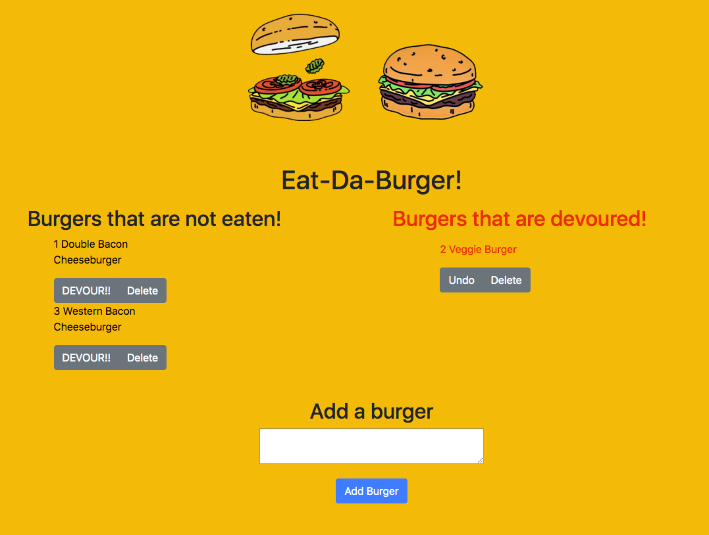

# EatDaBurger
At a high level this is a web-app that allows users to enter in burgers and then devour those burgers!

At a more detailed level, this app is a full stack (frontend and backend) application that allows a user to input a new burger and then click a button to 'devour it.' The app uses a modularized code base using a Model View Controller methodology and an Object-Relational Mapper to access the Mysql database.

## Technologies used 

* MySQL
* Javascript
* Bootstrap
* Node
* Express
* Handlebars
* Object-Relational Mapper (ORM)
* Model View Controller (MVC)

## Role in Development
I coded the front-end, server, database schema, and everything in between.

## See it in action

[Click here!](https://blooming-scrubland-23039.herokuapp.com/)

